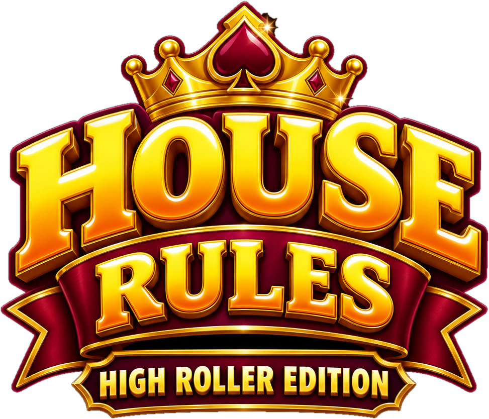
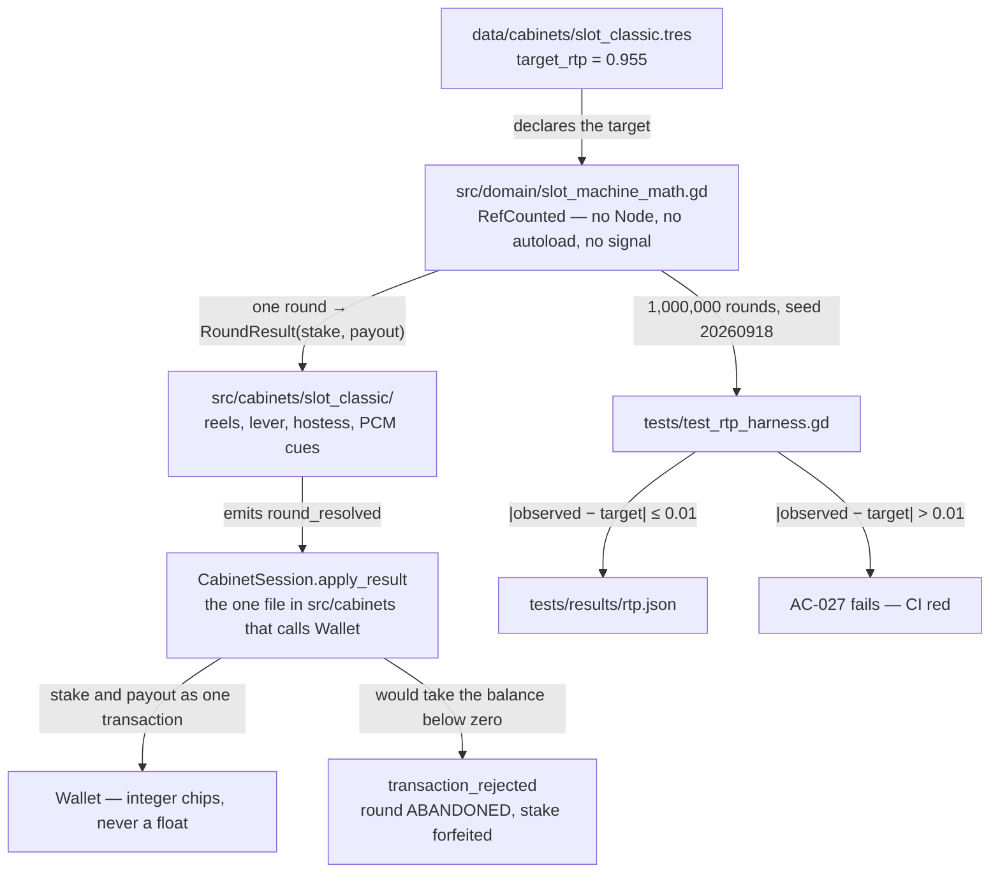
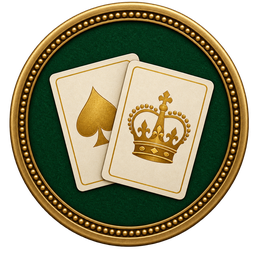
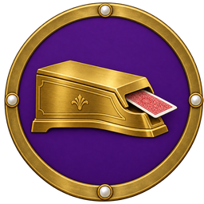
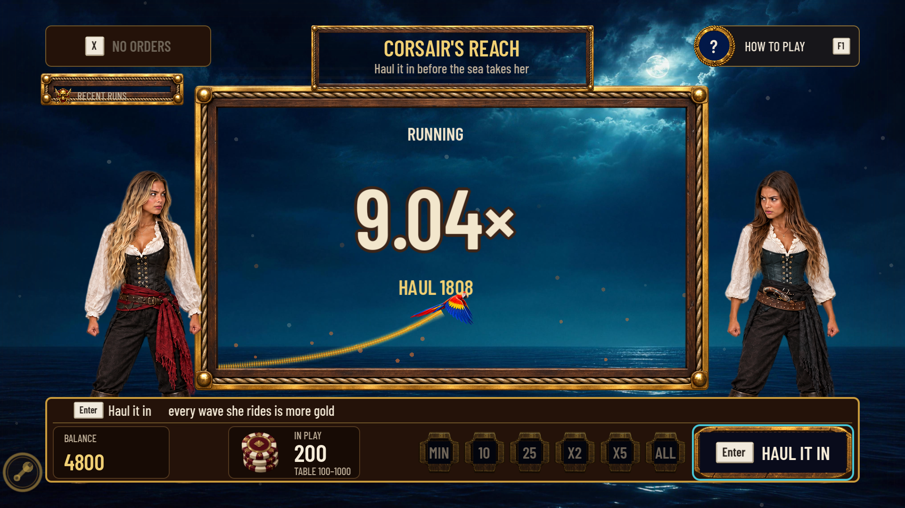
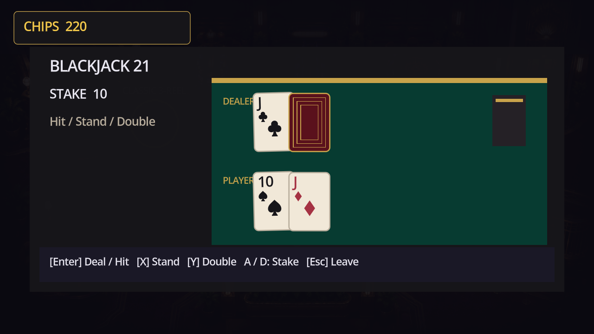
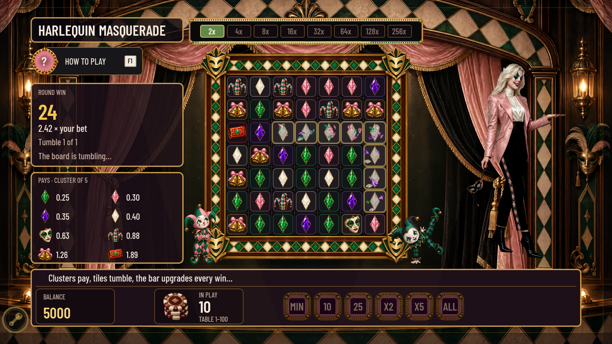
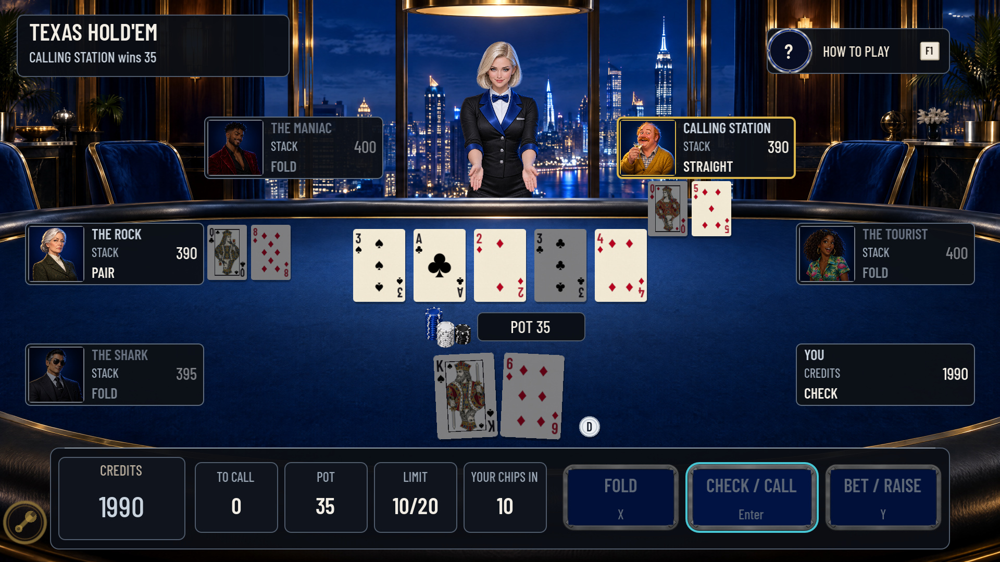
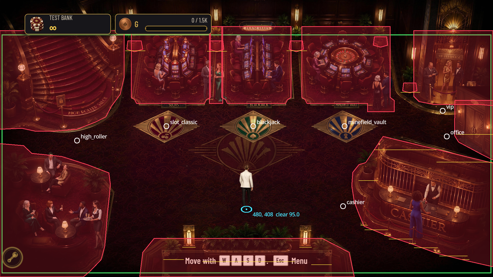
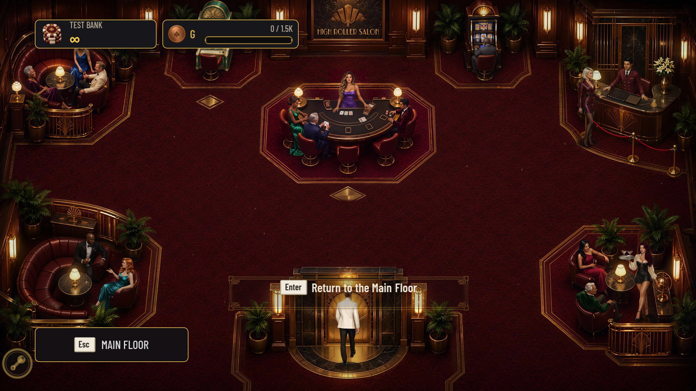

<div align="center">



</div>

<div align="center">

**House Rules is an offline casino you walk around with a gamepad: nine cabinets across four
rooms, one chip wallet, no real money anywhere in it. The house edge is a test — every cabinet's
payout maths is an engine-free library, and CI plays a million rounds of each one and fails the
build if the measured return drifts more than a percentage point from the declared target.**

Godot 4.7.2 and GDScript on the GL Compatibility renderer, drawn on a 960×540 virtual canvas that
scales to FHD, QHD and native 4K. Presentation and maths never touch: the reels, the felt and the
dealer cannot pay anybody. Reduced Motion is a single policy that every effect in the game honours
rather than a switch each screen reimplements, and every rendered pixel of art came out of a
recorded pipeline whose job IDs — including the rejected takes — are written down in
[`docs/art/GENERATION-REPORT.md`](docs/art/GENERATION-REPORT.md). **No .NET, no outbound network
call, no account, no telemetry, no real-money anything** — saves are plain JSON under `user://`.

<a href="https://github.com/DahanItamar/HouseRules/actions/workflows/ci.yml"></a>


<a href="docs/SPEC.md">Spec</a> ·
<a href="docs/cabinets/">Cabinets</a> ·
<a href="docs/art/GENERATION-REPORT.md">Art pipeline</a> ·
<a href="docs/DISPLAY-VALIDATION.md">Display</a> ·
<a href="docs/PROGRESSION.md">Progression</a>

</div>


---

## The house edge is a test

Each cabinet is two things that never touch. `src/domain/` holds the payout maths — thirty scripts,
every one of them `RefCounted` or `Resource`, with no `Node`, no `SceneTree`, no `signal` and not
one autoload named anywhere in the directory. `src/cabinets/` holds the reels, the felt, the
dealer and the sound, and it cannot pay anybody: a cabinet reports a finished round by emitting
`round_resolved(RoundResult)`, and `cabinet_session.gd` is the only file under `src/cabinets/` that
calls `Wallet` at all. The screens under `src/ui/` read the balance and never write it.

That split is not tidiness. It is what lets the test suite pick up the exact same maths object the
player is betting against and run a million rounds of it in a few seconds, with no game running.



### What the harness printed

Two of the nine lines from a full suite run on 2026-09-20, copied verbatim; the other seven are
the same shape and all nine are in [`tests/results/rtp.json`](tests/results/rtp.json).

```json
{"absolute_error":0.0000830000000000553,"cabinet":"slot_classic","elapsed_ms":3235,"observed_rtp":0.955083,"returned":9550830,"rounds":1000000,"seed":20260918,"strategy":"spin","target_rtp":0.955,"wagered":10000000}
{"absolute_error":0.0000518885176702399,"cabinet":"blackjack","elapsed_ms":7617,"observed_rtp":0.99005188851767,"returned":10854820,"rounds":1000000,"seed":20260918,"strategy":"basic strategy","target_rtp":0.99,"wagered":10963890}
```

Notice `wagered` on the blackjack line: **10,963,890 chips staked against 1,000,000 rounds of a
10-chip bet**, because the harness plays basic strategy and basic strategy doubles down. The
measured 99.005% is what a player actually gets back, not a paytable multiplied out on paper. And
because the seed is fixed, those two lines reproduce the committed `rtp.json` digit for digit —
the only field that moves between one run and the next is `elapsed_ms`.

## Nine cabinets, nine sets of maths

Every one of them is seated on a floor you can walk to. Nothing here opens only from a menu.

| | Cabinet | Room | Mechanic | Target | Measured |
|:-:|---|---|---|---:|---:|
|  | **Elven Court** | Main Floor | 3-reel, weighted strips, one payline | 95.50% | 95.508% |
|  | **Blackjack 21** | Main Floor | six-deck shoe, 3:2, dealer stands on all 17s | 99.00% | 99.005% |
|  | **Hexbound Vault** | Main Floor | 5×5 mines, true odds less the edge, cash out any time | 97.00% | 96.399% |
|  | **Velvet Baccarat** | High Roller Salon | punto banco, eight-deck shoe, exact commission | 98.90% | 98.994% |
|  | **Match Point** | High Roller Salon | 12-row plinko, thirteen courts, three risk curves | 96.00% | 96.132% |
|  | **Corsair's Reach** | High Roller Salon | crash — haul it in before the sea takes her | 97.00% | 96.751% |
|  | **Ruby Roulette** | VIP Penthouse | single-zero wheel, full inside/outside layout | 97.30% | 97.719% |
|  | **Texas Hold'em** | VIP Penthouse | five NPC archetypes, raked pot | *skill* | 106.494% |
|  | **Harlequin Masquerade** | VIP Penthouse | cluster pays, tumbles, a 2× to 256× upgrade bar | 96.60% | 96.459% |

Eight of the nine are measured over **1,000,000 rounds each** and asserted to within one
percentage point of the `target_rtp` declared in their `.tres` — that is acceptance criterion
AC-027, and it is a build failure, not a warning. Hold'em is the exception and says so in its own
record: return there depends on how well you play, so the harness deals **100,000 hands** of a
declared baseline strategy against the five NPCs and records the result as a baseline rather than
a target, including each NPC's big-blinds-per-100 so a regression in one opponent is visible.

Corsair's Reach is the crash cabinet: a parrot climbs an exponential curve inside a painted chart
frame, the multiplier is set as bare type over it, and the crew either side react to the same
frame she does. There is no ship and no dial, because a crash game is one object climbing a line
and everything else on the canvas competes with the number you are deciding against.









## Walking the floor

Each room is composed, not painted flat. A 3840×2160 background carries the room with its guests
already in it; a second transparent 3840×2160 layer carries only the *fronts* of things — plants,
rope lines, lamps, the cashier cage, the office doorway — and each of those fronts is cut out as a
polygon pinned to a `baseline`, the y where that object meets the floor. Inside the y-sorted depth
layer a character whose feet are above the baseline draws behind the object and one whose feet are
below it draws in front, so you walk behind the cashier's plant and back out in front of it without
a single hand-placed sprite.

Collision is traced from what you can see, not boxed around it. Across the four rooms that is
**40 solid polygons over 468 vertices**, named after the furniture they follow —
`GrandStaircase`, `SlotIsland`, `CashierCage`, `Lounge`, `EntrancePlanter` — plus **70
occluders**. `F2` draws the lot over the running game.



The red outlines are the whole argument: they follow the curve of the cashier cage and the corner
of each rug rather than a rectangle drawn around them, so you slide along the furniture you can see
instead of stopping in open carpet. The cyan dot is the foot anchor — the only thing that decides
both collision and depth, which is why a character's torso can overlap a machine without ever
reaching it.

The staircase and the lift are real destinations, not coordinates on the same floor plan. Each
room loads its own background, foreground, collision set, spawn and return point, keeps one player
and one wallet across the transition, and exits on <kbd>Esc</kbd> to a visible back control.



## Run it

Requires **Godot 4.7.2 stable** and nothing else — no .NET, no export templates for development,
no account, no asset download. Open `project.godot` in the editor and press <kbd>F5</kbd>, or point
the binary straight at the project:

```powershell
& 'C:\Godot\Godot_v4.7.2-stable_win64_console.exe' --path .
```

That opens on the menu at the top of this page. <kbd>WASD</kbd> or the left stick moves. Step into
a cabinet's brass inlay and <kbd>Enter</kbd> joins; <kbd>Esc</kbd> leaves, forfeiting the stake if
a round is live. <kbd>X</kbd> on the main menu toggles Reduced Motion. <kbd>F1</kbd> opens any
cabinet's help card, <kbd>F2</kbd> the collision overlay, and <kbd>F10</kbd> the developer menu in
a debug build.

Below, `godot` is that same 4.7.2 binary — substitute the full path if it is not on your `PATH`.

| Command | |
|---|---|
| `python tools/check_localization.py` | Passes: 623 keys, 451 referenced. No user-facing string is hardcoded |
| `gdformat --check src tests` and `gdlint src tests` | The formatting and lint gate, from `tools/requirements-dev.txt` |
| `godot --headless --path . -s addons/gut/gut_cmdln.gd -gexit` | 566 tests, 123,879 assertions, 52 scripts — 285 s, because it plays 8,100,000 real rounds on the way |
| `godot --headless --path . -s tests/slot_rtp_diagnostic.gd` | Slot variance diagnosis, written to `tests/results/slot_diagnostic.json` |

[`.github/workflows/ci.yml`](.github/workflows/ci.yml) — the **Godot checks** workflow behind the
badge — runs those four in that order on a pinned Godot 4.7.2 Linux build, with a resource-import
pass before the suite, and uploads `tests/results/*.json` as an artifact even when the run fails,
so the RTP evidence for a red build is downloadable from the run that produced it.

> [!WARNING]
> **If the suite leaves your working tree dirty, it is `tests/results/rtp.json` and nothing is
> wrong.** The harness rewrites that file with fresh `elapsed_ms` timings on every run, so the
> measurements are identical but the diff is not empty. Run `git checkout tests/results/rtp.json`
> afterwards; the canonical fixture is the one in the index.

## Under the hood — briefly

- **Reduced motion is a policy, not a setting each screen reinvents.** `MotionPolicy` is an
  autoload that 72 files under `src/` consult; it scales finite animations and removes ambient
  motion entirely, and `tests/test_reduced_motion_handoff.gd` proves a live spin, an ambient event
  and a credit transaction all settle on their exact canonical rest state when it is switched on
  mid-animation. Every cabinet's capture set includes its reduced-motion frames.
- **Every rendered asset has a recorded provenance.** The 4K room masters, the transparent host
  characters and the nine cabinet medallions were generated through a logged pipeline —
  [`docs/art/GENERATION-REPORT.md`](docs/art/GENERATION-REPORT.md) names the job ID behind each
  one, including the rejected takes — and the production files are derived from those raw outputs
  by scripts in `tools/art/`, never by hand-editing a master.
- **Currency is integer chips, end to end.** `Wallet` never performs floating-point arithmetic on
  a balance, fractional payouts round down once, and saves serialise currency as decimal strings so
  JSON cannot lose precision. RNG streams are named and persisted; a fresh blackjack table always
  starts a fresh six-deck shoe.
- **Controller-first, and checked at three resolutions.** Every interaction completes on a gamepad,
  prompts swap glyph sets when the active device changes, and the 960×540 canvas is verified at
  FHD, QHD and native 4K with no QHD letterboxing — see
  [`docs/DISPLAY-VALIDATION.md`](docs/DISPLAY-VALIDATION.md).

## Honestly

- **The repository is large on purpose: 3.15 GB of tracked files.** 1.94 GB is 4K art masters and
  their sources, and a further 1.2 GB is 718 committed screenshots — the capture sets that back
  every visual claim above, re-shot against the current build rather than kept from older ones.
  Cloning it is a real download; that was the trade made to keep the evidence in the repository
  rather than in a bug tracker.
- **There is no LICENSE file.** Nothing here is licensed for reuse yet. The vendored GUT 9.5.0 and
  the bundled Barlow Condensed family carry their own licences
  (`assets/fonts/OFL-BarlowCondensed.txt`).
- **The spec was written for a smaller game than the one that shipped.** Its fifty-three numbered
  acceptance criteria are current and are what the suite asserts, but the prose around them was
  drawn when v1 meant three machines and two locked doors. Read the criteria as the contract and
  the narrative as history.
- **The quick-bet row is not on every machine.** Elven Court, Blackjack, Hexbound Vault, Corsair's
  Reach and Harlequin Masquerade carry `MIN/10/25/X2/X5/ALL`. Roulette and Baccarat bet by placing
  chips of a chosen denomination on spots and Hold'em and Match Point use fixed stake keys, so the
  row does not map onto them. Whether it should is a design decision that has not been made.

> This README covers what the project is and how to see it run. The design behind it lives in
> [`docs/SPEC.md`](docs/SPEC.md) — fifty-three numbered acceptance criteria, the ones cited above
> among them — and one file per cabinet under [`docs/cabinets/`](docs/cabinets/), each stating its
> fantasy, its maths and its RTP before a line of it was written.

---

<div align="center">

Built by <a href="https://github.com/DahanItamar">Itamar Dahan</a> · © 2026

</div>
