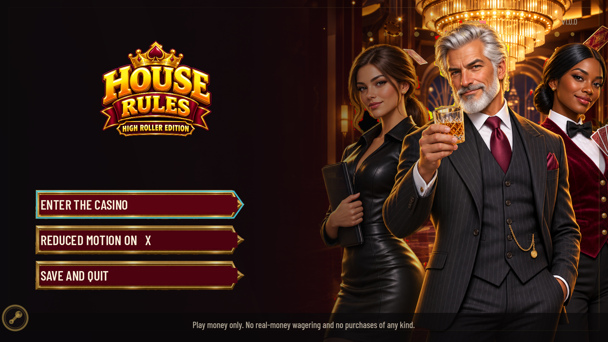

<div align="center">


# House Rules

**A complete, offline casino adventure built as an experiment in AI-assisted game development.**

Explore four rooms, play nine original casino cabinets, grow one shared bankroll,
and work your way toward owning the house. No accounts, purchases, telemetry, or
real-money wagering.

<a href="https://github.com/DahanItamar/HouseRules/actions/workflows/ci.yml"></a>


[Play](#play) - [Games](#nine-playable-cabinets) - [Controls](#controls) -
[Testing](#tested-gameplay) - [AI workflow](#built-with-ai) - [Documentation](#documentation)

</div>



## What is House Rules?

House Rules is a single-player, controller-friendly casino game made with Godot.
Instead of selecting games from a plain list, you walk through a connected casino,
approach a cabinet, and sit down to play. Every cabinet has its own theme, host,
rules, presentation, and mathematically tested return model.

The project was created to answer a practical question:

> How far can a small project go when human direction is paired with AI for design,
> programming, visual development, testing, documentation, and iteration?

The result is not a prompt demo or a collection of mockups. It is a playable game
with deterministic domain logic, persistent progression, accessibility support,
automated visual captures, and a full regression suite.

## Nine playable cabinets

| Cabinet | Room | Game |
|---|---|---|
| **Elven Court** | Main Floor | Three-reel slot with weighted strips and one payline |
| **Blackjack 21** | Main Floor | Six-deck blackjack, 3:2 naturals, dealer stands on 17 |
| **Hexbound Vault** | Main Floor | Pick safe vault tiles and cash out before finding a mine |
| **Velvet Baccarat** | High Roller Salon | Eight-deck punto banco with exact commission rules |
| **Match Point** | High Roller Salon | Tennis-themed Plinko with three risk tables |
| **Corsair's Reach** | High Roller Salon | Crash game: haul in the multiplier before the run ends |
| **Ruby Roulette** | VIP Penthouse | Single-zero roulette with inside and outside bets |
| **Texas Hold'em** | VIP Penthouse | Fixed-limit poker against five distinct NPC styles |
| **Harlequin Masquerade** | VIP Penthouse | Cluster pays, tumbles, and an escalating multiplier bar |

All games use play-money chips. Eight probability-driven cabinets are checked by
million-round simulations; Hold'em uses a deterministic baseline strategy because
its return depends on player decisions.

## Gallery


## Play

### Requirements

- Windows, Linux, or macOS supported by Godot 4.7.2
- Godot **4.7.2 stable** standard build; .NET is not required

### Run from the editor

1. Clone the repository.
2. Open `project.godot` in Godot 4.7.2.
3. Press <kbd>F5</kbd>.

From PowerShell, when Godot is installed at `C:\Godot`:

```powershell
& 'C:\Godot\Godot_v4.7.2-stable_win64.exe' --path .
```

The game is fully offline. Saves are stored locally in Godot's `user://` folder.

## Controls

| Action | Keyboard | Controller |
|---|---|---|
| Move / navigate | <kbd>WASD</kbd> or arrow keys | Left stick or D-pad |
| Interact / confirm | <kbd>Enter</kbd> | South face button |
| Back / leave | <kbd>Esc</kbd> | East face button |
| Help | <kbd>F1</kbd> | Menu / Start |
| Reduced Motion | <kbd>X</kbd> on the main menu | West face button |
| Debug collision view | <kbd>F2</kbd> | Debug builds only |
| Developer menu | <kbd>F10</kbd> | Debug builds only |

Every game can be completed with keyboard or controller. Focus is always visible,
all interactive targets meet the project's minimum size, and help cards display the
current device's controls without truncating operational instructions.

## Walking the casino

The casino is composed from separate background, foreground, collision, and depth
layers. Furniture collision follows visible shapes rather than broad rectangles,
and foreground pieces correctly pass in front of or behind the player according to
the character's foot position.


Four destinations are currently playable:

- Main Floor
- High Roller Salon
- VIP Penthouse
- Manager's Office

## Tested gameplay

The game separates presentation from settlement logic. Code in `src/domain/`
calculates outcomes without depending on scenes, animation, audio, or the wallet.
A cabinet emits one `RoundResult`; `CabinetSession` is the only layer allowed to
apply that result to the player's balance.

The current release gate contains:

- **573 tests across 53 scripts**
- **124,982 assertions**
- deterministic replay and wallet-transaction checks
- keyboard, controller, pointer, focus, and accessibility journeys
- FHD, QHD, and UHD layout validation
- reduced-motion handoff tests
- one million simulated rounds for each probability-driven cabinet
- a deterministic 100,000-hand Hold'em baseline

Run the same checks locally:

```powershell
python tools/check_localization.py
gdformat --check src tests
gdlint src tests
& 'C:\Godot\Godot_v4.7.2-stable_win64_console.exe' --headless --path . --import
& 'C:\Godot\Godot_v4.7.2-stable_win64_console.exe' --headless --path . -s addons/gut/gut_cmdln.gd -- -gexit
```

The RTP harness writes fresh timing values to `tests/results/rtp.json`; timing-only
changes are not gameplay changes. CI runs localization, formatting, linting, Godot
resource import, the full GUT suite, and the statistical simulations.

## Accessibility and privacy

- Complete keyboard and controller navigation
- Visible, component-contained focus indicators
- Reduced Motion available from the main menu
- Device-aware input prompts
- Local JSON saves only
- No sign-in, analytics, advertising, telemetry, or outbound runtime network calls
- No real-money wagering or purchases

## Built with AI

House Rules is intentionally an AI-assisted project. Human direction set the product
goals, taste, constraints, acceptance criteria, and final decisions. AI tools helped
with concept exploration, code implementation, art generation, iteration, testing,
and documentation.

Generated art was not accepted blindly. Assets were selected, cut out, aligned,
cleaned, integrated, captured in-engine, and checked against gameplay-safe regions.
The provenance and processing notes are recorded in
[`docs/art/GENERATION-REPORT.md`](docs/art/GENERATION-REPORT.md), including rejected
takes where relevant.

This repository is shared as a case study in what a disciplined human-and-AI workflow
can produce—not as evidence that one prompt created a finished game.

## Project structure

```text
assets/              Production art, fonts, and retained source material
data/                Cabinet definitions and paytables
docs/                Product, design, cabinet, display, and art documentation
src/domain/          Engine-independent game mathematics and result models
src/cabinets/        Playable cabinet state and session integration
src/floor/           Rooms, movement, collision, and world interaction
src/ui/              Menus, cabinet presentation, accessibility, and effects
tests/               GUT regression, simulation, and presentation tests
tools/               Capture, validation, and reproducible art-processing tools
```

## Documentation

- [`docs/SPEC.md`](docs/SPEC.md) - product contract and acceptance criteria
- [`docs/cabinets/`](docs/cabinets/) - rules and mathematics for every cabinet
- [`docs/PROGRESSION.md`](docs/PROGRESSION.md) - standing, rooms, and ownership arc
- [`docs/DISPLAY-VALIDATION.md`](docs/DISPLAY-VALIDATION.md) - resolution validation
- [`docs/MOTION-VALIDATION.md`](docs/MOTION-VALIDATION.md) - motion evidence
- [`docs/art/GENERATION-REPORT.md`](docs/art/GENERATION-REPORT.md) - AI art provenance

## Repository note

The repository includes high-resolution production art, retained source material,
and visual QA evidence, so cloning it is a substantial download. Generated caches,
exports, temporary captures, and retired one-off screenshot batches are excluded.

There is currently no project-level open-source license. Unless a license is added,
the source and original assets remain all rights reserved. Third-party components and
fonts retain their own licenses.

Topics: `godot`, `godot-game`, `mini-game`, `casino-game`,
`keyboard-accessible`, `controller-support`, `game-development`, and
`ai-assisted-development`.

---

<div align="center">

Created by <a href="https://github.com/DahanItamar">Itamar Dahan</a> with AI-assisted design and development.

Play money only. No real-money wagering or purchases.

</div>
