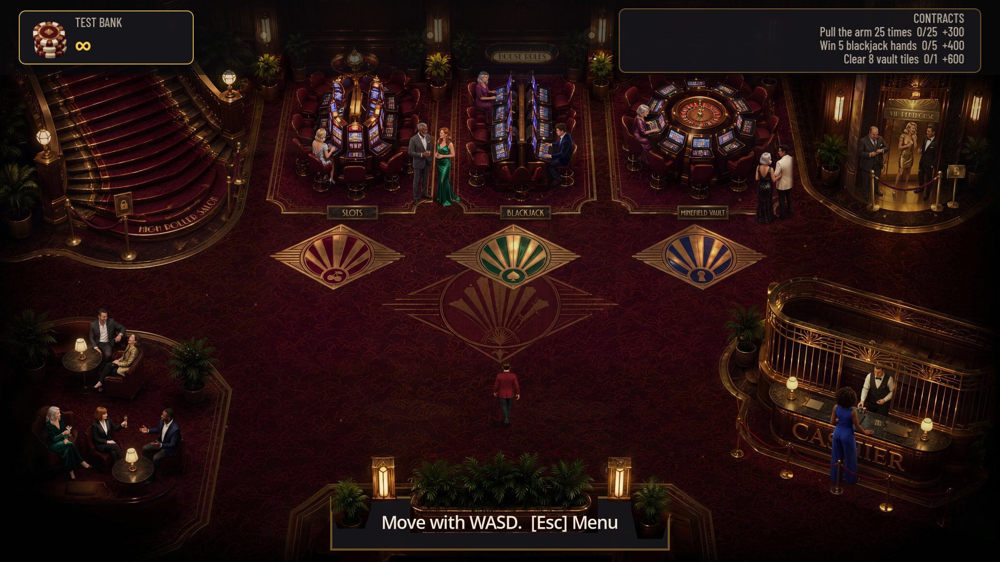
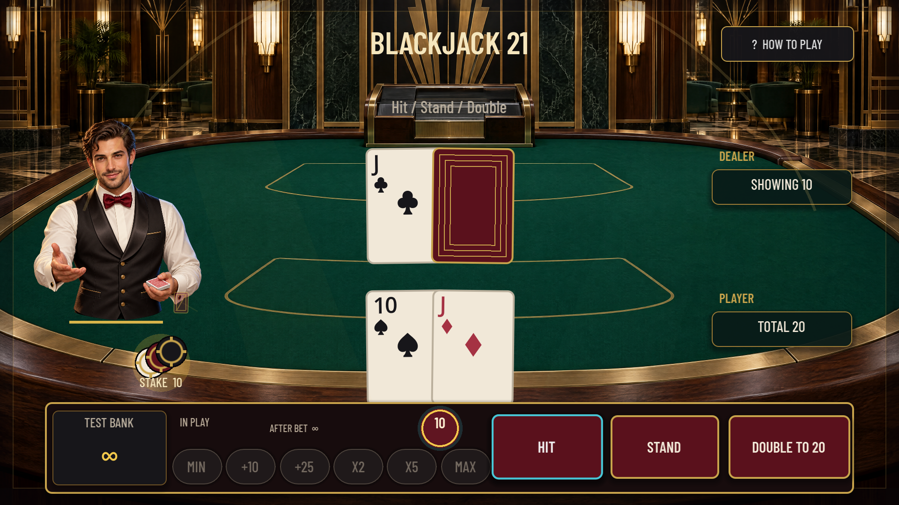
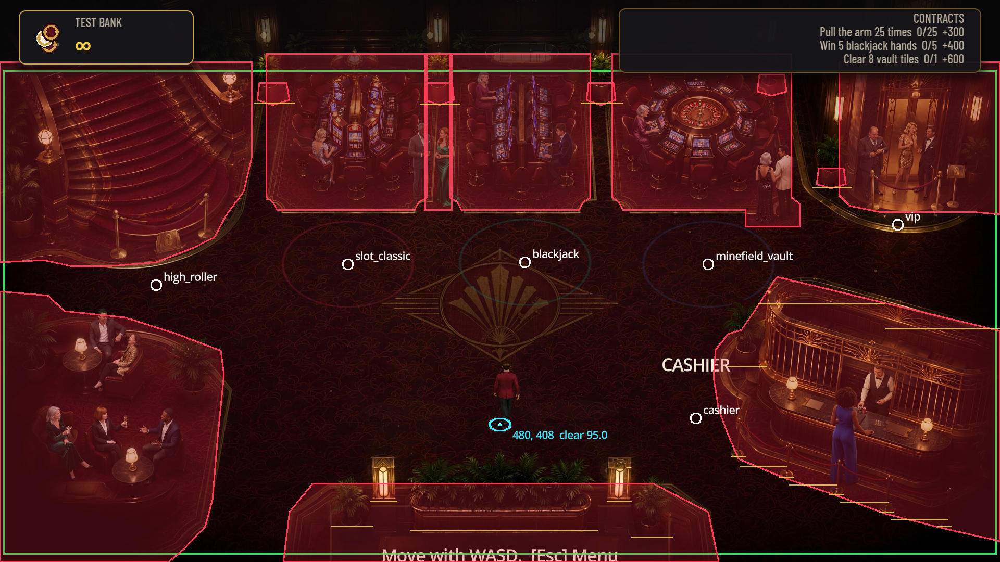

<div align="center">


**House Rules is an offline casino you walk around with a gamepad: nine cabinets across four
rooms, one chip wallet, no real money anywhere in it. The house edge is a test — every cabinet's
payout maths is an engine-free library, and CI plays a million rounds of each one and fails the
build if the measured return drifts more than a percentage point from the declared target.**

Godot 4.7.2 and GDScript on the GL Compatibility renderer, drawn on a 960×540 virtual canvas that
scales to FHD, QHD and native 4K. **No .NET, no outbound network call, no account, no telemetry,
no real-money anything** — saves are plain JSON under `user://`.

<a href="https://github.com/DahanItamar/HouseRules/actions/workflows/ci.yml"></a>


<a href="docs/SPEC.md">Spec</a> ·
<a href="docs/cabinets/">Cabinets</a> ·
<a href="docs/art/GENERATION-REPORT.md">Art pipeline</a> ·
<a href="docs/DISPLAY-VALIDATION.md">Display</a> ·
<a href="docs/PROGRESSION.md">Progression</a>



</div>

---

## The house edge is a test

Each cabinet is two things that never touch. `src/domain/` holds the payout maths — thirty scripts,
every one of them `RefCounted` or `Resource`, with no `Node`, no `SceneTree`, no `signal` and not
one autoload named anywhere in the directory. `src/cabinets/` holds the reels, the felt, the
dealer and the sound, and it cannot pay anybody: a cabinet reports a finished round by emitting
`round_resolved(RoundResult)`, and across the whole of `src/cabinets/` the only file that names
`Wallet` at all is `cabinet_session.gd`. The screens under `src/ui/` read the balance and never
change it.

That split is not tidiness. It is what lets the test suite pick up the exact same maths object the
player is betting against and run a million rounds of it in a few seconds, with no game running.


### What the harness printed

Two of the nine lines from a full suite run on 2026-09-20, copied verbatim; the other seven are
the same shape and all nine are in [`tests/results/rtp.json`](tests/results/rtp.json).

```json
{"absolute_error":0.0000830000000000553,"cabinet":"slot_classic","elapsed_ms":3714,"observed_rtp":0.955083,"returned":9550830,"rounds":1000000,"seed":20260918,"strategy":"spin","target_rtp":0.955,"wagered":10000000}
{"absolute_error":0.0000518885176702399,"cabinet":"blackjack","elapsed_ms":8292,"observed_rtp":0.99005188851767,"returned":10854820,"rounds":1000000,"seed":20260918,"strategy":"basic strategy","target_rtp":0.99,"wagered":10963890}
```

Notice `wagered` on the blackjack line: **10,963,890 chips staked against 1,000,000 rounds of a
10-chip bet**, because the harness plays basic strategy and basic strategy doubles down. The
measured 99.005% is what a player actually gets back, not a paytable multiplied out on paper. And
because the seed is fixed, those two lines reproduce the committed `rtp.json` digit for digit —
the only field that moved between the run above and the file in the index was `elapsed_ms`.

## Nine cabinets, nine sets of maths

| | Cabinet | Room | Mechanic | Target | Measured |
|:-:|---|---|---|---:|---:|
|  | **Elven Court** | Main Floor | 3-reel, weighted strips, one payline | 95.50% | 95.508% |
|  | **Blackjack 21** | Main Floor | six-deck shoe, 3:2, dealer stands on all 17s | 99.00% | 99.005% |
|  | **Hexbound Vault** | Main Floor | 5×5 mines, true odds less the edge, cash out any time | 97.00% | 96.399% |
|  | **Velvet Baccarat** | High Roller Salon | punto banco, eight-deck shoe, exact commission | 98.90% | 98.994% |
|  | **Match Point** | High Roller Salon | 12-row plinko, thirteen courts, three risk curves | 96.00% | 96.132% |
|  | **Ruby Roulette** | VIP Penthouse | single-zero wheel, full inside/outside layout | 97.30% | 97.719% |
|  | **Texas Hold'em** | VIP Penthouse | five NPC archetypes, raked pot | *skill* | 106.494% |
|  | **Forno d'Oro** | not seated yet | crash — pull it out before it burns | 97.00% | 96.751% |
|  | **Harlequin Masquerade** | not seated yet | cluster pays, tumbles, a 2× to 256× upgrade bar | 96.60% | 96.459% |

Eight of the nine are measured over **1,000,000 rounds each** and asserted to within one
percentage point of the `target_rtp` declared in their `.tres` — that is acceptance criterion
AC-027, and it is a build failure, not a warning. Hold'em is the exception and says so in its own
record: return there depends on how well you play, so the harness deals **100,000 hands** of a
declared baseline strategy against the five NPCs and records the result as a baseline rather than
a target, including each NPC's big-blinds-per-100 so a regression in one opponent is visible.

> [!IMPORTANT]
> **Forno d'Oro and Harlequin Masquerade are built, tested and measured, but no room seats them
> yet.** Their maths, scenes, art and RTP entries are all in — they simply have no join inlay on
> any floor plan, so in normal play you cannot walk up to them. They open from the developer menu
> (`F10`), and their row in the table above says so rather than implying a seat that is not there.




## Walking the floor

Each room is composed, not painted flat. A 3840×2160 background carries the room with its guests
already in it; a second transparent 3840×2160 layer carries only the *fronts* of things — plants,
rope lines, lamps, the cashier cage, the office doorway — and each of those fronts is cut out as a
polygon pinned to a `baseline`, the y where that object meets the floor. Inside the y-sorted depth
layer a character whose feet are above the baseline draws behind the object and one whose feet are
below it draws in front, so you walk behind the cashier's plant and back out in front of it without
a single hand-placed sprite.

Collision is traced from what you can see, not boxed around it. Across the four rooms that is
**40 solid polygons over 468 vertices**, named after the furniture they follow —
`GrandStaircase`, `SlotIsland`, `CashierCage`, `LoungeDais`, `EntrancePlanter` — plus **70
occluders**. `F2` draws the lot over the running game.



That is the room at the top of this page with `F2` held down, and the red outlines are the whole
argument: they follow the curve of the cashier cage and the corner of each rug rather than a
rectangle drawn around them, so you slide along the furniture you can see instead of stopping in
open carpet. The cyan dot is the foot anchor — the only thing that decides both collision and
depth, which is why a character's torso can overlap a machine without ever reaching it.

## Run it

Requires **Godot 4.7.2 stable** and nothing else — no .NET, no export templates for development,
no account, no asset download. Open `project.godot` in the editor and press <kbd>F5</kbd>, or point
the binary straight at the project:

```powershell
& 'C:\Godot\Godot_v4.7.2-stable_win64_console.exe' --path .
```

<kbd>WASD</kbd> or the left stick moves. Step into a cabinet's brass inlay and <kbd>Enter</kbd>
joins; <kbd>Esc</kbd> leaves, forfeiting the stake if a round is live. <kbd>X</kbd> on the main
menu toggles Reduced Motion. <kbd>F10</kbd> opens the developer menu in a debug build, which is how
you reach every room and every cabinet, including the two the floor plans do not seat yet.

Below, `godot` is that same 4.7.2 binary — substitute the full path if it is not on your `PATH`.

| Command | |
|---|---|
| `python tools/check_localization.py` | Passes: 618 keys, 444 referenced. No user-facing string is hardcoded |
| `gdformat --check src tests` and `gdlint src tests` | The formatting and lint gate, from `tools/requirements-dev.txt` |
| `godot --headless --path . -s addons/gut/gut_cmdln.gd -gexit` | 566 tests, 123,860 assertions, 52 scripts — 305 s, because it plays 8,100,000 real rounds on the way |
| `godot --headless --path . -s tests/slot_rtp_diagnostic.gd` | Slot variance diagnosis, written to `tests/results/slot_diagnostic.json` |

[`.github/workflows/ci.yml`](.github/workflows/ci.yml) — the **Godot checks** workflow behind the
badge — runs those four in that order on a pinned Godot 4.7.2 Linux build, with a resource-import
pass before the suite, and uploads `tests/results/*.json` as an artifact even when the run fails,
so the RTP evidence for a red build is downloadable from the run that produced it.

> [!WARNING]
> **If the suite leaves your working tree dirty, it is `tests/results/rtp.json` and nothing is
> wrong.** The harness rewrites that file with fresh `elapsed_ms` timings on every run, so the
> measurements are identical but the diff is not empty. Run `git checkout tests/results/rtp.json`
> afterwards; the canonical fixture is the one in the index.

## Under the hood — briefly

- **Reduced motion is a policy, not a setting each screen reinvents.** `MotionPolicy` is an
  autoload that 71 files consult; it scales finite animations to 0.6 and removes ambient motion
  entirely, and `tests/test_reduced_motion_handoff.gd` proves a live spin, an ambient event and a
  credit transaction all settle on their exact canonical rest state when it is switched on
  mid-animation.
- **Every rendered asset has a recorded provenance.** The 4K room masters, the transparent host
  characters and the nine cabinet medallions were generated through a logged pipeline —
  [`docs/art/GENERATION-REPORT.md`](docs/art/GENERATION-REPORT.md) names the job ID behind each
  one, including the rejected takes — and the production files are derived from those raw outputs
  by scripts in `tools/art/`, never by hand-editing a master.
- **Currency is integer chips, end to end.** `Wallet` never performs floating-point arithmetic on
  a balance, fractional payouts round down once, and saves serialise currency as decimal strings so
  JSON cannot lose precision. RNG streams are named and persisted; a fresh blackjack table always
  starts a fresh six-deck shoe.
- **Controller-first, and checked at three resolutions.** Every interaction completes on a gamepad,
  prompts swap glyph sets when the active device changes, and the 960×540 canvas is verified at
  FHD, QHD and native 4K with no QHD letterboxing — see
  [`docs/DISPLAY-VALIDATION.md`](docs/DISPLAY-VALIDATION.md).
- **The repository is large on purpose: 3.2 GB of tracked files.** 2.2 GB is 4K art masters and
  their sources, and a further 947 MB is 622 committed screenshots — the capture sets that back the
  visual claims above. Cloning it is a real download; that was the trade made to keep the evidence
  in the repository rather than in a bug tracker.
- **There is no LICENSE file.** Nothing here is licensed for reuse yet. The vendored GUT 9.5.0 and
  the bundled Barlow Condensed family carry their own licences
  (`assets/fonts/OFL-BarlowCondensed.txt`).

> This README covers what the project is and how to see it run. The design behind it lives in
> [`docs/SPEC.md`](docs/SPEC.md) — fifty-three numbered acceptance criteria, the ones cited above
> among them — and one file per cabinet under [`docs/cabinets/`](docs/cabinets/), each stating its
> fantasy, its maths and its RTP before a line of it was written.

---

<div align="center">


Built by <a href="https://github.com/DahanItamar">Itamar Dahan</a> · © 2026

</div>
